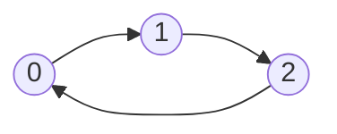
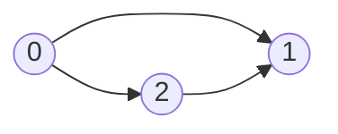
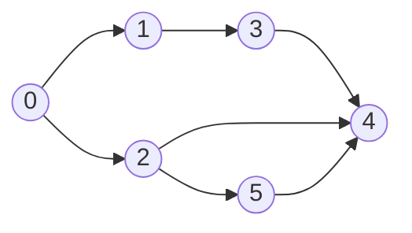

## DFS 算法



以 0 为起始

```
Visited: T, F, F
```

接着遍历 1

```
Visited: T, T, F
```

接着遍历 2

```
Visited: T, T, T
```

接着遍历 0

发现 0 已经为 T，即存在环

看一个无环的例子



以 0 为起始

```
Visited: T, F, F
```

接着遍历 1

```
Visited: T, T, F
```

1 没有子节点了，所以重置状态回到 0

```
Visited: T, F, F
```

接着遍历 2

```
Visited: T, F, T
```

接着遍历 1

```
Visited: T, T, T
```

1 没有子节点了，所以重置状态回到 2

```
Visited: T, F, T
```

2 没有子节点了，所以重置状态回到 0

```
Visited: T, F, F
```

0 没子节点了，重置状态

```
Visited: F, F, F
```

## Kahn 算法

1. 首先计算所有节点的 indegree 数

2. 将 indegree 数为 0 的节点加入 Queue，同时加入到结果数组 Result 中

3. 循环弹出处理 Queue 中的节点

   1. 将节点 outdregee 指向的节点 indregee 数减 1
   2. 如果 outdregee 指向的节点的 indregee 数为 0，则加入 Queue，同时加入到结果数组 Result 中

4. 循环结束后，如果 Result 中的节点数不等于图中的节点总数，则存在环


