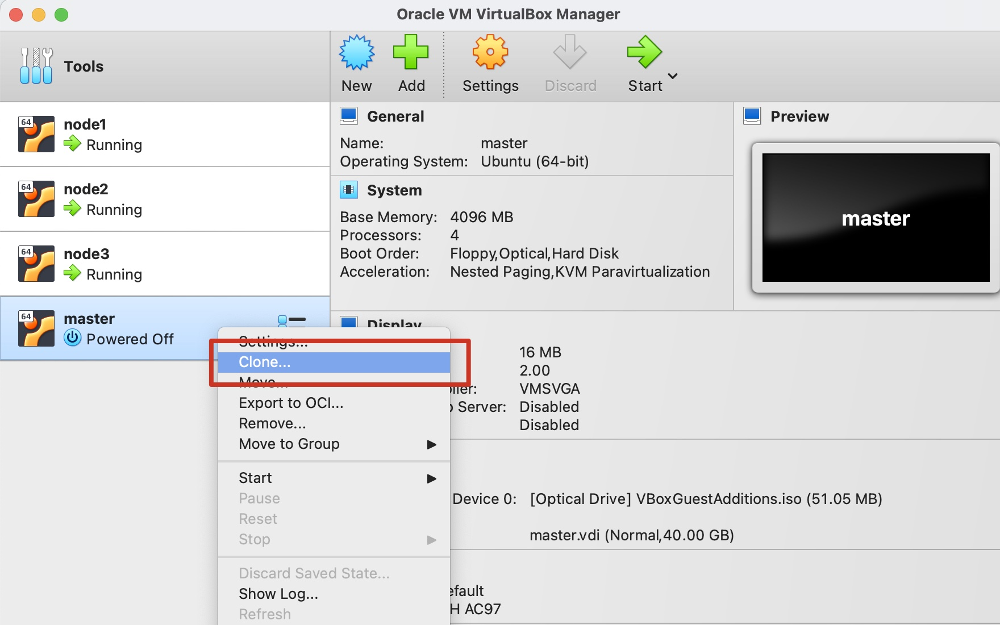
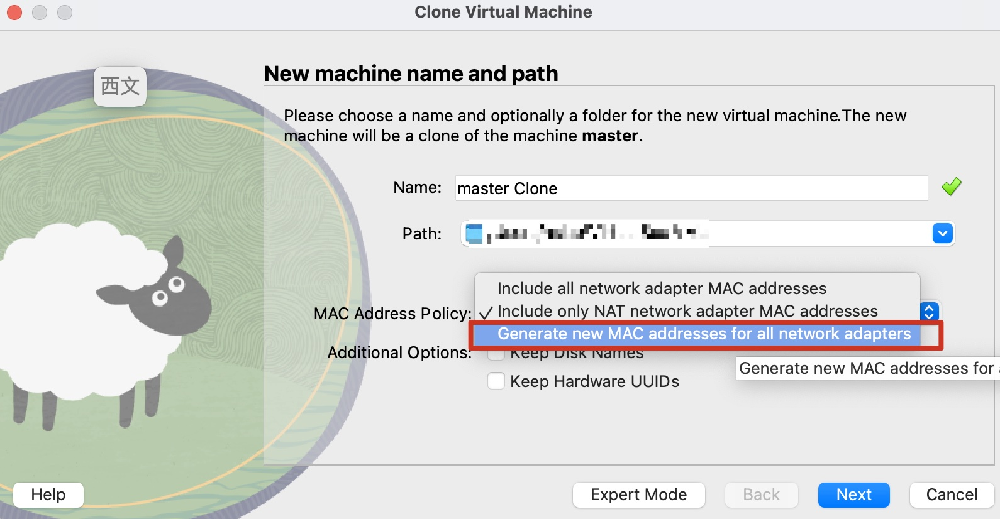
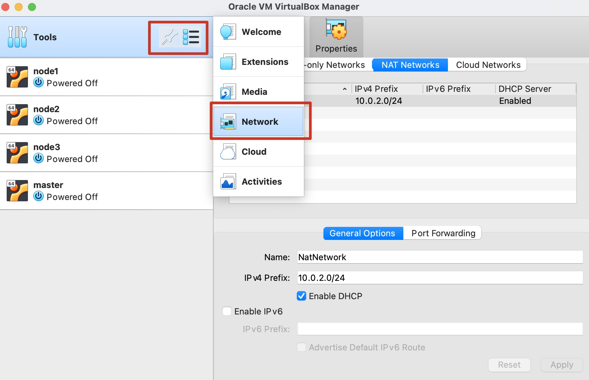

## 准备机器

4 台虚拟机：

```
master (4C4G)
node1 (2C2G)
node2 (2C2G)
node3 (2C2G)
```

[ubuntu 22.04](https://mirrors.aliyun.com/ubuntu-releases/22.04/ubuntu-22.04.4-desktop-amd64.iso?spm=a2c6h.25603864.0.0.2b7e45f8oHZTnH)

设置 [清华源](https://mirrors.tuna.tsinghua.edu.cn/help/ubuntu/)

关闭 swap（kubelet 要求）：

```bash
# 查看 swap 是否开启，有输出内容即表示开启
swapon --show

# 临时关闭 swap，重启后又会打开
sudo swapoff -a

# 永久关闭，打开 /etc/fstab，注释掉 /swapfile 开头的一行
sudo vim /etc/fstab

# 重启机器
sudo reboot
```

允许远程登录：

```bash
# 安装 ssh-server
sudo apt update
sudo apt install openssh-server
sudo systemctl status ssh

# 防火墙准入 ssh
sudo ufw allow ssh
```


然后拷贝虚拟机实例



注意分配新的 mac 地址



使用 NAT，设置 DHCP




设置虚拟机使用 NAT Network


## 安装 docker

安装 docker，详细参考 [How To Install and Use Docker on Ubuntu 22.04](https://www.digitalocean.com/community/tutorials/how-to-install-and-use-docker-on-ubuntu-22-04)，下面是文中的主要命令

```bash
# First, update your existing list of packages:
sudo apt update

# Next, install a few prerequisite packages which let apt use packages over HTTPS:
sudo apt install apt-transport-https ca-certificates curl software-properties-common

# Then add the GPG key for the official Docker repository to your system:
curl -fsSL https://download.docker.com/linux/ubuntu/gpg | sudo gpg --dearmor -o /usr/share/keyrings/docker-archive-keyring.gpg

# Add the Docker repository to APT sources:
echo "deb [arch=$(dpkg --print-architecture) signed-by=/usr/share/keyrings/docker-archive-keyring.gpg] https://download.docker.com/linux/ubuntu $(lsb_release -cs) stable" | sudo tee /etc/apt/sources.list.d/docker.list > /dev/null

sudo apt update
sudo apt upgrade

# 安装 docker
sudo apt install docker-ce

# 确定 docker 正在运行
sudo systemctl status docker
```

设置 docker 使用 systemd 而非 cgroupfs:

```bash
# 写入配置
sudo mkdir -p /etc/systemd/system/docker.service.d
sudo tee /etc/docker/daemon.json <<EOF
{
  "exec-opts": ["native.cgroupdriver=systemd"],
  "log-driver": "json-file",
  "log-opts": {
    "max-size": "100m"
  },
  "storage-driver": "overlay2"
}
EOF

# 开启 cri
sudo vim /etc/containerd/config.toml
# 注释掉 disabled_plugins = ["cri"]


## 重启
sudo systemctl daemon-reload
sudo systemctl restart docker
sudo systemctl enable docker
```

## 安装 cri-dockerd

> apt install docker.io 时才需要手动安装

k8s 需要 cri-dockerd 驱动 docker，安装方式：

```bash
# 下载
wget https://github.com/Mirantis/cri-dockerd/releases/download/v0.3.15/cri-dockerd_0.3.15.3-0.ubuntu-jammy_amd64.deb

# 安装
sudo dpkg -i cri-dockerd_0.3.15.3-0.ubuntu-jammy_amd64.deb

# 启动服务
sudo systemctl daemon-reload
sudo systemctl enable cri-docker.service
sudo systemctl enable --now cri-docker.socket

# 确定 cri-dockerd 已运行
systemctl status cri-docker.socket
```

## 安装 kubeadm

下载 kubelet kubeadm kubectl (1.19.3):

- [kubelet](https://dl.k8s.io/v1.30.3/bin/linux/amd64/kubelet)

- [kubeadm](https://cdn.dl.k8s.io/release/v1.19.3/bin/linux/amd64/kubeadm)

- [kubectl](https://dl.k8s.io/v1.19.3/bin/linux/amd64/kubectl)

```bash
curl -fsSL https://pkgs.k8s.io/core:/stable:/v1.30/deb/Release.key | sudo gpg --dearmor -o /etc/apt/keyrings/kubernetes-apt-keyring.gpg

echo 'deb [signed-by=/etc/apt/keyrings/kubernetes-apt-keyring.gpg] https://pkgs.k8s.io/core:/stable:/v1.30/deb/ /' | sudo tee /etc/apt/sources.list.d/kubernetes.list

sudo apt update

sudo apt install kubeadm kubelet kubectl

# 锁版本
sudo apt-mark hold kubeadm kubelet kubectl
```

载入必要的内核模块:

```bash
sudo vim /etc/modules-load.d/containerd.conf
```

加入下面的内容:

```
overlay
br_netfilter
```

载入模块：

```bash
sudo modprobe overlay
sudo modprobe br_netfilter
```

设置 k8s 网络：

```bash
sudo vim /etc/sysctl.d/kubernetes.conf
```

加入下面的内容：

```
net.bridge.bridge-nf-call-ip6tables = 1
net.bridge.bridge-nf-call-iptables = 1
net.ipv4.ip_forward = 1
```

生效上面的配置：

```bash
sudo sysctl --system
```

```bash
kubeadm init --pod-network-cidr=10.244.0.0/16 \
          --control-plane-endpoint=master \
          --upload-certs
```

> 从 1.22 开始 kubelet 默认使用 systemd

```
Your Kubernetes control-plane has initialized successfully!

To start using your cluster, you need to run the following as a regular user:

  mkdir -p $HOME/.kube
  sudo cp -i /etc/kubernetes/admin.conf $HOME/.kube/config
  sudo chown $(id -u):$(id -g) $HOME/.kube/config

Alternatively, if you are the root user, you can run:

  export KUBECONFIG=/etc/kubernetes/admin.conf

You should now deploy a pod network to the cluster.
Run "kubectl apply -f [podnetwork].yaml" with one of the options listed at:
  https://kubernetes.io/docs/concepts/cluster-administration/addons/

You can now join any number of the control-plane node running the following command on each as root:

  kubeadm join master:6443 --token m731wc.8gcbtat2yzlyu9y6 \
        --discovery-token-ca-cert-hash sha256:71b3b7a423bf5dc0a6433d34c15b163782fbbe956e718dd2a64aaae651c5b142 \
        --control-plane --certificate-key a7bdc95f61ef4bae2e66cdab4bc68efff1652d4d5e0dadf0ea6a529e15508327

Please note that the certificate-key gives access to cluster sensitive data, keep it secret!
As a safeguard, uploaded-certs will be deleted in two hours; If necessary, you can use
"kubeadm init phase upload-certs --upload-certs" to reload certs afterward.

Then you can join any number of worker nodes by running the following on each as root:

kubeadm join master:6443 --token m731wc.8gcbtat2yzlyu9y6 \
        --discovery-token-ca-cert-hash sha256:71b3b7a423bf5dc0a6433d34c15b163782fbbe956e718dd2a64aaae651c5b142
```

> [!NOTE]
> 网络一定要通畅，否则下载不了镜像，会导致 kubelet 间歇性重启，查看 containerd 的日志会发现类似 `failed to setup network for podsandbox` 之类的报错


```bash
sudo cp -i /etc/kubernetes/admin.conf $HOME/.kube/config
sudo chown $(id -u):$(id -g) $HOME/.kube/config
```


### 创建 Pod Network

```bash
kubectl apply -f https://github.com/flannel-io/flannel/releases/latest/download/kube-flannel.yml
```

### 关闭 AppArmor

关闭安全策略以便 Worker Node 可以加入进来

```bash
sudo systemctl stop apparmor && sudo systemctl disable apparmor
```

## 创建 namespace

## 创建 service account

## 部署 tekton，指定 namespace