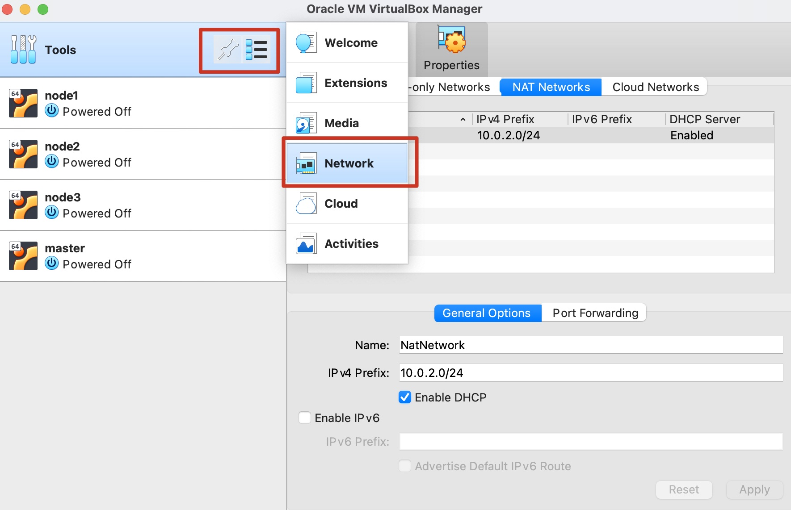
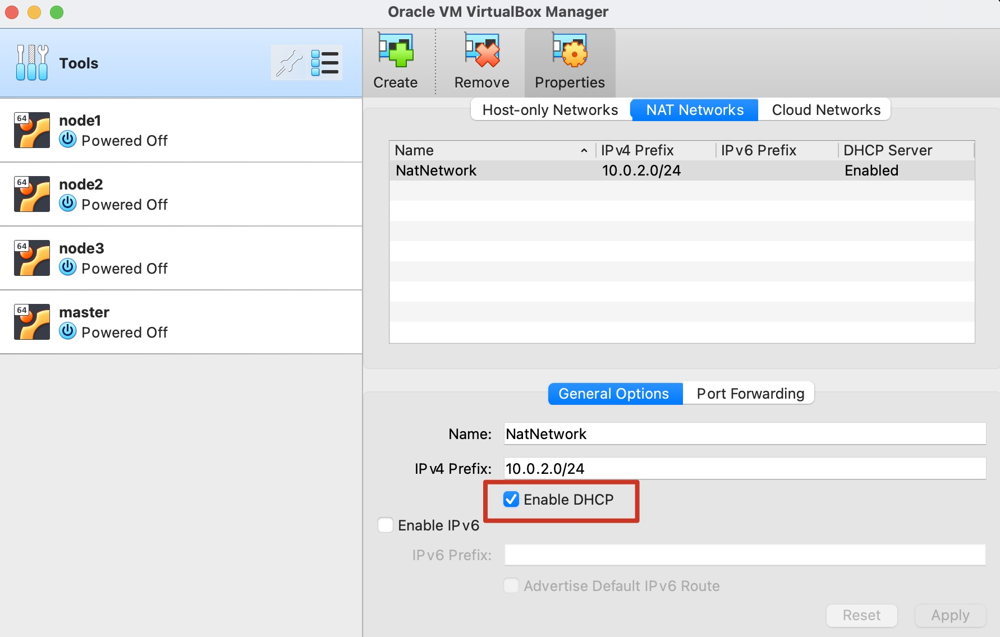
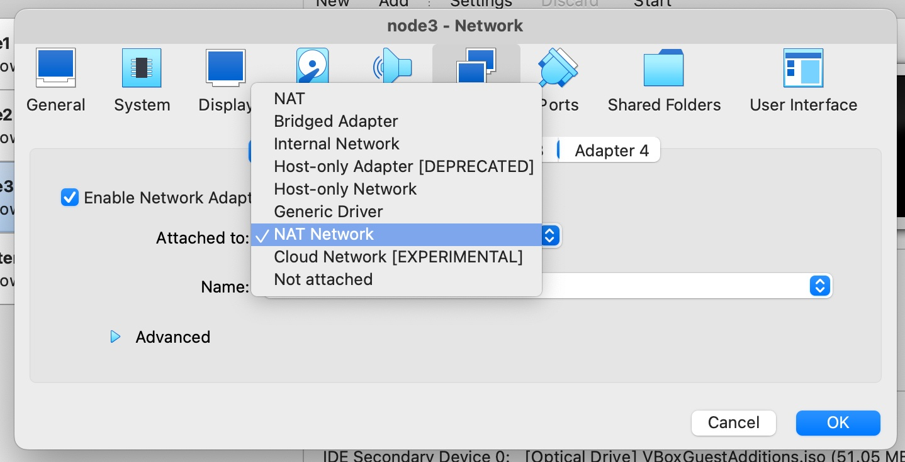
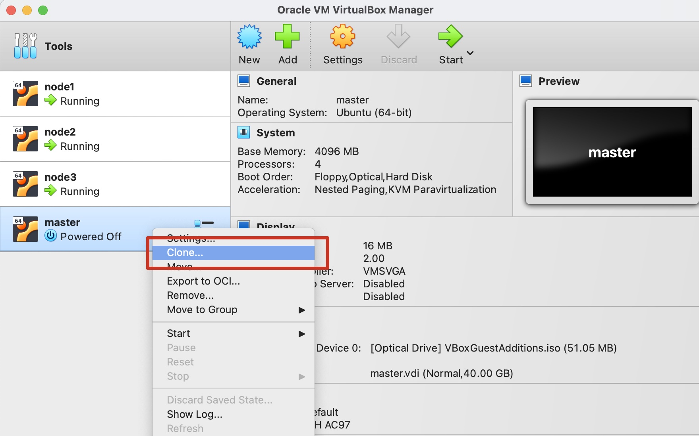
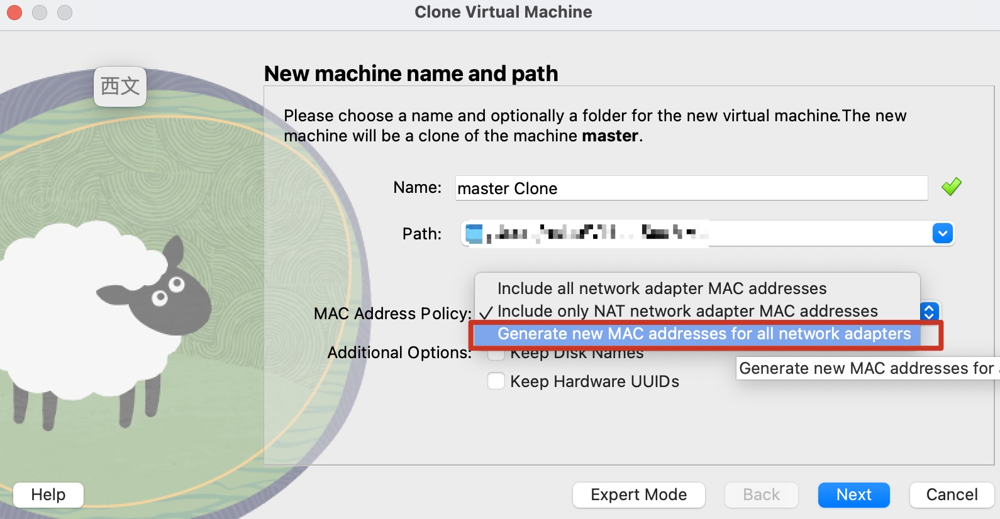

## 背景

前端构建流水线使用 tekton，需要具备基本的运维知识。通过本地部署 k8s 来了解其中的组件

## 准备机器

目标是准备 4 台虚拟机：

1. master 1 台(4CPUs 4GB)

2. worker node 3 台(2CPUs 2GB)

先创建作为 master 的虚拟机，然后通过「拷贝虚拟机」的方式创建剩余的机器以节约时间

镜像选择 [ubuntu 20.04.6](https://mirrors.aliyun.com/ubuntu-releases/20.04.6/)，安装的过程根据向导来即可，这里就跳过了

安装完毕进入系统

设置 [清华源](https://mirrors.tuna.tsinghua.edu.cn/help/ubuntu/) 后更新系统：

```bash
sudo apt update && sudo apt upgrade
```

允许远程登录：

```bash
# 安装 ssh-server
sudo apt update
sudo apt install openssh-server
sudo systemctl status ssh
```

设置系统启动后进命令行，而不是图形节目，节约下不必要的内存

```bash
sudo vi /etc/default/grub
```

设置下面的内容：

```bash
GRUB_CMDLINE_LINUX_DEFAULT="text"
GRUB_TERMINAL=console
GRUB_RECORDFAIL_TIMEOUT=1
```

然后生效上面的配置:

```bash
sudo update-grub
sudo systemctl enable multi-user.target --force
sudo systemctl set-default multi-user.target
```

创建 NAT 网络，设置 DHCP





设置虚拟机使用 NAT Network



> 后面只需要打开虚拟机，然后从宿主机上 SSH 远程进虚拟机即可

关闭 swap（kubelet 要求）：

```bash
# 查看 swap 是否开启，有输出内容即表示开启
swapon --show

# 临时关闭 swap，重启后又会打开
sudo swapoff -a

# 永久关闭，打开 /etc/fstab，注释掉 /swapfile 开头的一行
sudo vim /etc/fstab

# 重启机器
sudo reboot
```

## 设置虚拟机 DNS

```bash
# 忽略网络自动设置的 dns
sudo nmcli connection modify 'Wired connection 1' ipv4.ignore-auto-dns yes
# 手动指定
sudo nmcli connection modify 'Wired connection 1' ipv4.dns "8.8.8.8"

# 重启网络服务
sudo nmcli connection reload
sudo systemctl restart NetworkManager
```

## 安装 docker

安装 docker，详细参考 [How To Install and Use Docker on Ubuntu 22.04](https://www.digitalocean.com/community/tutorials/how-to-install-and-use-docker-on-ubuntu-22-04)，下面是文中的主要命令

```bash
# First, update your existing list of packages:
sudo apt update

# Next, install a few prerequisite packages which let apt use packages over HTTPS:
sudo apt install apt-transport-https ca-certificates curl software-properties-common

# Then add the GPG key for the official Docker repository to your system:
curl -fsSL https://download.docker.com/linux/ubuntu/gpg | sudo gpg --dearmor -o /usr/share/keyrings/docker-archive-keyring.gpg

# Add the Docker repository to APT sources:
echo "deb [arch=$(dpkg --print-architecture) signed-by=/usr/share/keyrings/docker-archive-keyring.gpg] https://download.docker.com/linux/ubuntu $(lsb_release -cs) stable" | sudo tee /etc/apt/sources.list.d/docker.list > /dev/null

sudo apt update && sudo apt upgrade

# 安装 docker
sudo apt install docker-ce

# 确定 docker 正在运行
sudo systemctl status docker
```

设置 docker 使用 systemd 而非 cgroupfs:

```bash
# 写入配置
sudo mkdir -p /etc/systemd/system/docker.service.d
sudo tee /etc/docker/daemon.json <<EOF
{
  "exec-opts": ["native.cgroupdriver=systemd"],
  "log-driver": "json-file",
  "log-opts": {
    "max-size": "100m"
  },
  "storage-driver": "overlay2"
}
EOF

# 开启 cri
sudo vim /etc/containerd/config.toml
# 注释掉 disabled_plugins = ["cri"]

## 重启
sudo systemctl daemon-reload
sudo systemctl restart docker
# 系统启动后自动运行
sudo systemctl enable docker
```

> 从 1.22 开始 kubelet 默认使用 systemd，需要统一 kubelet 和 docker 的 `cgroupdriver`

## 安装 kubeadm kubelet kubectl

```bash
sudo mkdir /etc/apt/keyrings/

curl -fsSL https://pkgs.k8s.io/core:/stable:/v1.30/deb/Release.key | sudo gpg --dearmor -o /etc/apt/keyrings/kubernetes-apt-keyring.gpg

echo 'deb [signed-by=/etc/apt/keyrings/kubernetes-apt-keyring.gpg] https://pkgs.k8s.io/core:/stable:/v1.30/deb/ /' | sudo tee /etc/apt/sources.list.d/kubernetes.list

sudo apt update

sudo apt install kubeadm kubelet kubectl

# 锁版本
sudo apt-mark hold kubeadm kubelet kubectl
```

载入必要的内核模块:

```bash
sudo vim /etc/modules-load.d/containerd.conf
```

加入下面的内容:

```
overlay
br_netfilter
```

载入模块：

```bash
sudo modprobe overlay
sudo modprobe br_netfilter
```

设置 k8s 网络：

```bash
sudo vim /etc/sysctl.d/kubernetes.conf
```

加入下面的内容：

```
net.bridge.bridge-nf-call-ip6tables = 1
net.bridge.bridge-nf-call-iptables = 1
net.ipv4.ip_forward = 1
```

生效上面的配置：

```bash
sudo sysctl --system
```

## 拷贝虚拟机

然后拷贝虚拟机实例



注意分配新的 mac 地址



## 设置 master

```bash
sudo systemctl daemon-reload && sudo systemctl restart kubelet

# hosts 中加入 master 机器名（创建虚拟机时设置的机器名）
sudo vim /etc/hosts
# 127.0.0.1 master

sudo kubeadm init --pod-network-cidr=10.244.0.0/16 --control-plane-endpoint=master --upload-certs
```

> 上面的命令会从 docker hub 拉去必要的初始化镜像，所以需要确保网络通畅

注意保存一下命令成功的结果，以便后续加入节点：

```bash
Your Kubernetes control-plane has initialized successfully!

To start using your cluster, you need to run the following as a regular user:

  mkdir -p $HOME/.kube
  sudo cp -i /etc/kubernetes/admin.conf $HOME/.kube/config
  sudo chown $(id -u):$(id -g) $HOME/.kube/config

Alternatively, if you are the root user, you can run:

  export KUBECONFIG=/etc/kubernetes/admin.conf

You should now deploy a pod network to the cluster.
Run "kubectl apply -f [podnetwork].yaml" with one of the options listed at:
  https://kubernetes.io/docs/concepts/cluster-administration/addons/

You can now join any number of the control-plane node running the following command on each as root:

  kubeadm join master:6443 --token dzo1ct.rajg40qyvd7z2z1r \
        --discovery-token-ca-cert-hash sha256:b076e42813911124fc89c23f17c2e852d82ebc3223542bea1f48af37cee3f2cf \
        --control-plane --certificate-key fe2ee380b7d0d89287176bd8691498825b65f8d6ca7ee9398d5000ac7f6894ee

Please note that the certificate-key gives access to cluster sensitive data, keep it secret!
As a safeguard, uploaded-certs will be deleted in two hours; If necessary, you can use
"kubeadm init phase upload-certs --upload-certs" to reload certs afterward.

Then you can join any number of worker nodes by running the following on each as root:

kubeadm join master:6443 --token dzo1ct.rajg40qyvd7z2z1r \
        --discovery-token-ca-cert-hash sha256:b076e42813911124fc89c23f17c2e852d82ebc3223542bea1f48af37cee3f2cf
```

设置下 kubectl 的认证信息：

```bash
sudo mkdir -p $HOME/.kube/
sudo cp -i /etc/kubernetes/admin.conf $HOME/.kube/config
sudo chown -R $(id -u):$(id -g) $HOME/.kube/
```

设置网络：

```bash
sudo systemctl stop apparmor && sudo systemctl disable apparmor
sudo systemctl restart containerd.service
sudo systemctl restart kubelet.service
```

创建 Pod Network

```bash
kubectl apply -f https://github.com/flannel-io/flannel/releases/latest/download/kube-flannel.yml
```

## 设置 worker node

设置网络：

```bash
sudo systemctl stop apparmor && sudo systemctl disable apparmor
sudo systemctl restart containerd.service
sudo systemctl restart kubelet.service
```

加入集群

```bash
sudo kubeadm join master:6443 --token dzo1ct.rajg40qyvd7z2z1r \
        --discovery-token-ca-cert-hash sha256:b076e42813911124fc89c23f17c2e852d82ebc3223542bea1f48af37cee3f2cf
```

## 创建 user account

创建私钥

```bash
openssl genpkey -out hsy.key -algorithm Ed25519
```

创建 certificate signing request (CSR)

```bash
# 用户名 user, group: fed
openssl req -new -key hsy.key -out hsy.csr -subj "/CN=hsy/O=fed"
cat hsy.csr | base64 | tr -d "\n"
```

> 有的网页里通过 `,` 分隔 `-subj` 中的内容，比如 `-subj "/CN=hsy,/O=fed"` 是不对的，会导致 user name 被识别成 `hsy,`

将 CSR 发到 k8s 中，创建文件 `csr.yaml`，输入下面内容：

```yaml
apiVersion: certificates.k8s.io/v1
kind: CertificateSigningRequest
metadata:
  name: hsy
spec:
  request: 上一步的输出
  signerName: kubernetes.io/kube-apiserver-client
  expirationSeconds: 31536000 # one year
  usages:
    - client auth
```

执行：

```bash
k apply -f csr.yaml
k certificate approve hsy
```

创建用户配置：

```bash
kubectl get csr/hsy -o jsonpath="{.status.certificate}" | base64 -d > hsy.crt

# 往配置文件中增加 user
kubectl --kubeconfig ~/.kube/config config set-credentials hsy --client-key hsy.key --client-certificate hsy.crt --embed-certs=true

# 将 user 和 context 绑定
kubectl --kubeconfig ~/.kube/config config set-context hsy --cluster kubernetes --user hsy
```

新创建的 user account 默认时没有权限的：

```bash
# 切换到新帐号
kubectl config use-context hsy

k get nodes
# Error from server (Forbidden): nodes is forbidden: User "hsy" cannot list resource "nodes" in API group "" at the cluster scope: RBAC: clusterrole.rbac.authorization.k8s.io "node-viewer" not found
```

创建一个 Cluster role，名为 `node-viewer`，可以查看节点信息：

```bash
# 切回管理帐号
kubectl config use-context kubernetes-admin@kubernetes

# nodes 属于 cluster scope，所以创建 cluster role
kubectl create clusterrole node-viewer --verb=list,get --resource=nodes

# 将用户所在的组和 Role 进行绑定
kubectl create clusterrolebinding node-viewer-fed --clusterrole=node-viewer --group=fed
```

## 创建 namespace

创建一个名为 `fed` 的 namespace 用于管理前端相关的资源

```bash
k create namespace fed
```

创建一个 Role，名为 `fed-viewer` 用于查看 namespace 下的资源：

```bash
k create role fed-viewer --verb=list,get,watch --resource=pods,deployments --namespace=fed
```

将用户所在的组和 Role 进行绑定

```bash
k create rolebinding fed-viewer --role=fed-viewer --group=fed --namespace=fed
```

这样当使用 `hsy` 帐号时，若要查看 pods，则必须指定 namespace:

```bash
k get pods --namespace=fed
```

创建一个 Role，名为 `fed-writer`，用于部署 pod

```bash
k create role fed-writer --verb=create,update,patch,delete --resource=pods,deployments --namespace=fed
k create rolebinding fed-writer --role=fed-writer --group=fed --namespace=fed
```

使用 hsy 帐号在不指定 namespace 的情况下执行 hello-world:

```bash
k create deployment hello-node --image=registry.k8s.io/e2e-test-images/agnhost:2.39 -- /agnhost netexec --http-port=8080
# error: failed to create deployment: deployments.apps is forbidden: User "hsy" cannot create resource "deployments" in API group "apps" in the namespace "default"
```

可见命令执行失败，指定 namespace 为 fed:

```bash
k create deployment hello-node --image=registry.k8s.io/e2e-test-images/agnhost:2.39 --namespace fed -- /agnhost netexec --http-port=8080
# deployment.apps/hello-node created
```

## 为 namespace 绑定节点

```bash
sudo vim /etc/kubernetes/manifests/kube-apiserver.yaml
```

在 `--enable-admission-plugins` 中增加 Admission-plugin `PodNodeSelector`:

```yaml
spec:
  containers:
  - command:
    - kube-apiserver
    - --advertise-address=10.0.2.15
    - --allow-privileged=true
    - --authorization-mode=Node,RBAC
    - --client-ca-file=/etc/kubernetes/pki/ca.crt
    - --enable-admission-plugins=NodeRestriction,PodNodeSelector
```

重启 kubelet

```bash
sudo systemctl restart kubelet.service
```

编辑 namespace，增加 `scheduler.alpha.kubernetes.io/node-selector` 注解:

```yaml
apiVersion: v1
kind: Namespace
metadata:
  annotations:
    scheduler.alpha.kubernetes.io/node-selector: kubernetes.io/hostname=node1
  creationTimestamp: "2024-08-12T11:21:21Z"
  labels:
    kubernetes.io/metadata.name: fed
  name: fed
  resourceVersion: "24281"
  uid: 7cba4f97-c237-4682-acf8-cff27179bc33
spec:
  finalizers:
  - kubernetes
status:
  phase: Active
```

实际的节点 label 可以这样查看：

```bash
k get nodes --show-labels
```

再次部署 hello-world:

```bash
k create deployment hello-node1 --image=registry.k8s.io/e2e-test-images/agnhost:2.39 --namespace fed -- /agnhost netexec --http-port=8080
```

可以发现 hello-node1 的 Pod 被调度到 node1 上：

```bash
k get pods -o wide --namespace fed
```

```
NAME                           READY   STATUS    RESTARTS   AGE     IP           NODE    NOMINATED NODE   READINESS GATES
hello-node-55fdcd95bf-vrphw    1/1     Running   0          87m     10.244.2.2   node2   <none>           <none>
hello-node1-86495748b6-br7tx   1/1     Running   0          4m58s   10.244.1.2   node1   <none>           <none>
```

## 小结

小结分两部分，其一是我们对 k8s 有了一个大致的了解：

- kukeadm 是一个管理软件，创建 master node 或者往集群加入 worker node

- kubelet 则是节点上的 agent，master 节点用于部署管控组件进行任务调度，worker 节点这用于响应调度、创建 Pods 执行任务

- kubectl 则是用户侧的命令行，通过和 master 节点中的 api-server 通信，管理集群

其二是我们可以梳理出一个前后的隔离的 tekton 方案：

1. tekton 部署在前端的 ns 下面，比如 fed-ns

2. 创建一个 user account，比如 fed-mgr

3. 创建一个 role，fed-mgr-role，可以管理 fed-ns 下面的资源

4. 创建一个 rolebinding，关联 fed-mgr 和 fed-mgr-role

5. fed-ns 设置了 scheduler.alpha.kubernetes.io/node-selector 绑定前端构建节点

这样一来 fed-mgr 只能操作 fed-ns 下面的资源，并且 fed-ns 下的 Pod 会调度到前端构建节点，这样应该不会影 horizon 组件

另一个方案是现在杭州的形式，前后的共用一个 tekeon，只是前端的构建 Pod 指定 node-selector 到前端构建机，由于是技术中心统一的 tekton，所以也就和现在一致交由 PE 运维

两个方案 PE 都会和云原生团队讨论评估，在不影响系统稳定性和运维工作量的情况下，开放一定的权限
