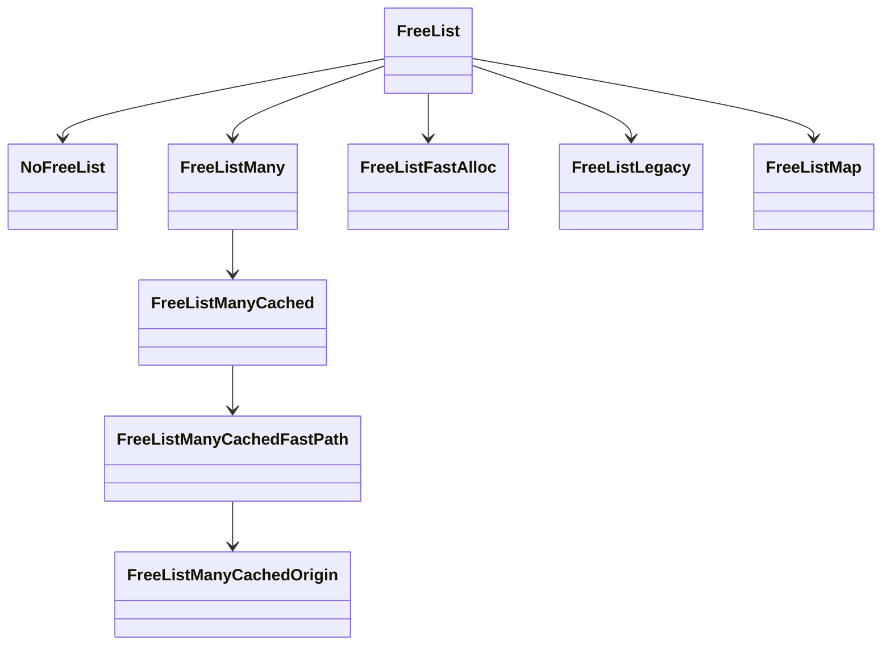

```cpp
DEFINE_INT(gc_freelist_strategy, 5,
           "Freelist strategy to use: "
           "0:FreeListLegacy. "
           "1:FreeListFastAlloc. "
           "2:FreeListMany. "
           "3:FreeListManyCached. "
           "4:FreeListManyCachedFastPath. "
           "5:FreeListManyCachedOrigin. ")
```

## NoFreeList

```cpp
// FreeList used for spaces that don't have freelists
// (only the LargeObject space for now).
```

## FreeListLegacy

```cpp
// The free list is organized in categories as follows:
// kMinBlockSize-10 words (tiniest): The tiniest blocks are only used for
//   allocation, when categories >= small do not have entries anymore.
// 11-31 words (tiny): The tiny blocks are only used for allocation, when
//   categories >= small do not have entries anymore.
// 32-255 words (small): Used for allocating free space between 1-31 words in
//   size.
// 256-2047 words (medium): Used for allocating free space between 32-255 words
//   in size.
// 1048-16383 words (large): Used for allocating free space between 256-2047
//   words in size.
// At least 16384 words (huge): This list is for objects of 2048 words or
//   larger. Empty pages are also added to this list.
```

## FreeListFastAlloc

```cpp
// Inspired by FreeListLegacy.
// Only has 3 categories: Medium, Large and Huge.
// Any block that would have belong to tiniest, tiny or small in FreeListLegacy
// is considered wasted.
// Allocation is done only in Huge, Medium and Large (in that order),
// using a first-fit strategy (only the first block of each freelist is ever
// considered though). Performances is supposed to be better than
// FreeListLegacy, but memory usage should be higher (because fragmentation will
// probably be higher).
```

## FreeListMany

```cpp
// Use 24 Freelists: on per 16 bytes between 24 and 256, and then a few ones for
// larger sizes. See the variable |categories_min| for the size of each
// Freelist.  Allocation is done using a best-fit strategy (considering only the
// first element of each category though).
// Performances are expected to be worst than FreeListLegacy, but memory
// consumption should be lower (since fragmentation should be lower).
```

## FreeListManyCached

```cpp
// Same as FreeListMany but uses a cache to know which categories are empty.
// The cache (|next_nonempty_category|) is maintained in a way such that for
// each category c, next_nonempty_category[c] contains the first non-empty
// category greater or equal to c, that may hold an object of size c.
// Allocation is done using the same strategy as FreeListMany (ie, best fit).
```

## FreeListManyCachedFastPath

```cpp
// Same as FreeListManyCached but uses a fast path.
// The fast path overallocates by at least 1.85k bytes. The idea of this 1.85k
// is: we want the fast path to always overallocate, even for larger
// categories. Therefore, we have two choices: either overallocate by
// "size_in_bytes * something" or overallocate by "size_in_bytes +
// something". We choose the later, as the former will tend to overallocate too
// much for larger objects. The 1.85k (= 2048 - 128) has been chosen such that
// for tiny objects (size <= 128 bytes), the first category considered is the
// 36th (which holds objects of 2k to 3k), while for larger objects, the first
// category considered will be one that guarantees a 1.85k+ bytes
// overallocation. Using 2k rather than 1.85k would have resulted in either a
// more complex logic for SelectFastAllocationFreeListCategoryType, or the 36th
// category (2k to 3k) not being used; both of which are undesirable.
// A secondary fast path is used for tiny objects (size <= 128), in order to
// consider categories from 256 to 2048 bytes for them.
// Note that this class uses a precise GetPageForSize (inherited from
// FreeListMany), which makes its fast path less fast in the Scavenger. This is
// done on purpose, since this class's only purpose is to be used by
// FreeListManyCachedOrigin, which is precise for the scavenger.
```

## FreeListManyCachedOrigin

```cpp
// Uses FreeListManyCached if in the GC; FreeListManyCachedFastPath otherwise.
// The reasonning behind this FreeList is the following: the GC runs in
// parallel, and therefore, more expensive allocations there are less
// noticeable. On the other hand, the generated code and runtime need to be very
// fast. Therefore, the strategy for the former is one that is not very
// efficient, but reduces fragmentation (FreeListManyCached), while the strategy
// for the later is one that is very efficient, but introduces some
// fragmentation (FreeListManyCachedFastPath).
```

## FreeSpace

```cpp
// FreeSpace are fixed-size free memory blocks used by the heap and GC.
// They look like heap objects (are heap object tagged and have a map) so that
// the heap remains iterable.  They have a size and a next pointer.
// The next pointer is the raw address of the next FreeSpace object (or NULL)
// in the free list.
```

## Object

```cpp
// Object is the abstract superclass for all classes in the
// object hierarchy.
// Object does not use any virtual functions to avoid the
// allocation of the C++ vtable.
// There must only be a single data member in Object: the Address ptr,
// containing the tagged heap pointer that this Object instance refers to.
// For a design overview, see https://goo.gl/Ph4CGz.
```

## MapWord

```cpp
// Heap objects typically have a map pointer in their first word.  However,
// during GC other data (e.g. mark bits, forwarding addresses) is sometimes
// encoded in the first word.  The class MapWord is an abstraction of the
// value in a heap object's first word.
```

Object::kHeaderSize 0
HeapObject::kHeaderSize 8(开启指针压缩的情况下为 4)

## Map

/Users/hsiao/Developer/node/out/Release/obj/gen/torque-output-root/torque-generated/field-offsets-tq.h

```cpp
// All heap objects have a Map that describes their structure.
//  A Map contains information about:
//  - Size information about the object
//  - How to iterate over an object (for garbage collection)
//
// Map layout:
// +---------------+------------------------------------------------+
// |   _ Type _    | _ Description _                                |
// +---------------+------------------------------------------------+
// | TaggedPointer | map - Always a pointer to the MetaMap root     |
// +---------------+------------------------------------------------+
// | Int           | The first int field                            |
//  `---+----------+------------------------------------------------+
//      | Byte     | [instance_size]                                |
//      +----------+------------------------------------------------+
//      | Byte     | If Map for a primitive type:                   |
//      |          |   native context index for constructor fn      |
//      |          | If Map for an Object type:                     |
//      |          |   inobject properties start offset in words    |
//      +----------+------------------------------------------------+
//      | Byte     | [used_or_unused_instance_size_in_words]        |
//      |          | For JSObject in fast mode this byte encodes    |
//      |          | the size of the object that includes only      |
//      |          | the used property fields or the slack size     |
//      |          | in properties backing store.                   |
//      +----------+------------------------------------------------+
//      | Byte     | [visitor_id]                                   |
// +----+----------+------------------------------------------------+
// | Int           | The second int field                           |
//  `---+----------+------------------------------------------------+
//      | Short    | [instance_type]                                |
//      +----------+------------------------------------------------+
//      | Byte     | [bit_field]                                    |
//      |          |   - has_non_instance_prototype (bit 0)         |
//      |          |   - is_callable (bit 1)                        |
//      |          |   - has_named_interceptor (bit 2)              |
//      |          |   - has_indexed_interceptor (bit 3)            |
//      |          |   - is_undetectable (bit 4)                    |
//      |          |   - is_access_check_needed (bit 5)             |
//      |          |   - is_constructor (bit 6)                     |
//      |          |   - has_prototype_slot (bit 7)                 |
//      +----------+------------------------------------------------+
//      | Byte     | [bit_field2]                                   |
//      |          |   - new_target_is_base (bit 0)                 |
//      |          |   - is_immutable_proto (bit 1)                 |
//      |          |   - unused bit (bit 2)                         |
//      |          |   - elements_kind (bits 3..7)                  |
// +----+----------+------------------------------------------------+
// | Int           | [bit_field3]                                   |
// |               |   - enum_length (bit 0..9)                     |
// |               |   - number_of_own_descriptors (bit 10..19)     |
// |               |   - is_prototype_map (bit 20)                  |
// |               |   - is_dictionary_map (bit 21)                 |
// |               |   - owns_descriptors (bit 22)                  |
// |               |   - is_in_retained_map_list (bit 23)           |
// |               |   - is_deprecated (bit 24)                     |
// |               |   - is_unstable (bit 25)                       |
// |               |   - is_migration_target (bit 26)               |
// |               |   - is_extensible (bit 28)                     |
// |               |   - may_have_interesting_symbols (bit 28)      |
// |               |   - construction_counter (bit 29..31)          |
// |               |                                                |
// +****************************************************************+
// | Int           | On systems with 64bit pointer types, there     |
// |               | is an unused 32bits after bit_field3           |
// +****************************************************************+
// | TaggedPointer | [prototype]                                    |
// +---------------+------------------------------------------------+
// | TaggedPointer | [constructor_or_backpointer_or_native_context] |
// +---------------+------------------------------------------------+
// | TaggedPointer | [instance_descriptors]                         |
// +****************************************************************+
// ! TaggedPointer ! [layout_descriptors]                           !
// !               ! Field is only present if compile-time flag     !
// !               ! FLAG_unbox_double_fields is enabled            !
// !               ! (basically on 64 bit architectures)            !
// +****************************************************************+
// | TaggedPointer | [dependent_code]                               |
// +---------------+------------------------------------------------+
// | TaggedPointer | [prototype_validity_cell]                      |
// +---------------+------------------------------------------------+
// | TaggedPointer | If Map is a prototype map:                     |
// |               |   [prototype_info]                             |
// |               | Else:                                          |
// |               |   [raw_transitions]                            |
// +---------------+------------------------------------------------+
```

offset 定义在 [map.h#L845](https://github.com/nodejs/node/blob/9cd523d148dcefa6dd86cb7ef6448520aad5c574/deps/v8/src/objects/map.h#L845)

```cpp
#define TORQUE_GENERATED_MAP_FIELDS(V) \
V(kInstanceSizeInWordsOffset, kUInt8Size) \
V(kInObjectPropertiesStartOrConstructorFunctionIndexOffset, kUInt8Size) \
V(kUsedOrUnusedInstanceSizeInWordsOffset, kUInt8Size) \
V(kVisitorIdOffset, kUInt8Size) \
V(kInstanceTypeOffset, kUInt16Size) \
V(kBitFieldOffset, kUInt8Size) \
V(kBitField2Offset, kUInt8Size) \
V(kBitField3Offset, kInt32Size) \
V(kOptionalPaddingOffset, kInt32Size) \
V(kStartOfStrongFieldsOffset, 0) \
V(kPrototypeOffset, kTaggedSize) \
V(kConstructorOrBackPointerOrNativeContextOffset, kTaggedSize) \
V(kInstanceDescriptorsOffset, kTaggedSize) \
V(kLayoutDescriptorOffset, 0) \
V(kDependentCodeOffset, kTaggedSize) \
V(kPrototypeValidityCellOffset, kTaggedSize) \
V(kEndOfStrongFieldsOffset, 0) \
V(kStartOfWeakFieldsOffset, 0) \
V(kTransitionsOrPrototypeInfoOffset, kTaggedSize) \
V(kEndOfWeakFieldsOffset, 0) \
V(kHeaderSize, 0) \
V(kSize, 0) \


#define DEFINE_ONE_FIELD_OFFSET(Name, Size) Name, Name##End = Name + (Size)-1,

#define DEFINE_FIELD_OFFSET_CONSTANTS(StartOffset, LIST_MACRO) \
  enum {                                                       \
    LIST_MACRO##_StartOffset = StartOffset - 1,                \
    LIST_MACRO(DEFINE_ONE_FIELD_OFFSET)                        \
  };


  DEFINE_FIELD_OFFSET_CONSTANTS(HeapObject::kHeaderSize,
                                TORQUE_GENERATED_MAP_FIELDS)
```

## HeapObject

```cpp
// HeapObject is the superclass for all classes describing heap allocated
// objects.
```

python dump /Users/hsiao/Developer/node/deps/v8/tools/grokdump.py

instance type /Users/hsiao/Developer/node/deps/v8/tools/v8heapconst.py

CanSubclassHaveInobjectProperties 哪些类型可以有 inobject properties

```cpp
enum class AllocationType : uint8_t {
  kYoung,    // Regular object allocated in NEW_SPACE or NEW_LO_SPACE
  kOld,      // Regular object allocated in OLD_SPACE or LO_SPACE
  kCode,     // Code object allocated in CODE_SPACE or CODE_LO_SPACE
  kMap,      // Map object allocated in MAP_SPACE
  kReadOnly  // Object allocated in RO_SPACE
};
```

CalculateInstanceSizeHelper 负责根据实例的类型计算大小

JS_FUNCTION_TYPE

kTaggedSize，kApiTaggedSize 在 64bit 上默认 8bytes

kMaxInstanceSize = 255

```cpp
static const int kJSObjectHeaderSize = 3 * kApiTaggedSize;
STATIC_ASSERT(kHeaderSize == Internals::kJSObjectHeaderSize);
static const int kMaxInObjectProperties =
    (kMaxInstanceSize - kHeaderSize) >> kTaggedSizeLog2;
```

`SharedFunctionInfo::UpdateExpectedNofPropertiesFromEstimate` 会在后续更新对象的 `set_expected_nof_properties`

`SharedFunctionInfo::Init` 是在 RO_SPACE 上初始化的，最初初始化的时候 ` set_expected_nof_properties(0)`

```cpp
int JSFunction::CalculateExpectedNofProperties(Isolate* isolate,
                                               Handle<JSFunction> function) {

  // ...

  // Inobject slack tracking will reclaim redundant inobject space
  // later, so we can afford to adjust the estimate generously,
  // meaning we over-allocate by at least 8 slots in the beginning.
  if (expected_nof_properties > 0) {
    expected_nof_properties += 8;
    if (expected_nof_properties > JSObject::kMaxInObjectProperties) {
      expected_nof_properties = JSObject::kMaxInObjectProperties;
    }
  }
  return expected_nof_properties;
}
```

从函数创建的对象，都会根据构造函数的 `initial_map()` 中的 `instance_size()` 大小来创建

```cpp
// 确保函数有 initial_map
// 如果函数有了 initial_map 则直接返回，否则继续初始化 initial_map
// 初始化 initial_map 的过程中，重头戏就是计算 instance_size
// instance_size 包含固定的组成部分：
// - https://medium.com/@bpmxmqd/v8-engine-jsobject-structure-analysis-and-memory-optimization-ideas-be30cfcdcd16
// - inobject properties
void JSFunction::EnsureHasInitialMap(Handle<JSFunction> function) {

}
```

对于从构造函数初始化的对象来说，首先需要编译构造函数（因为 v8 的延迟编译技术）编辑后，还需要遍历原型链，以计算出所有继承的属性的数量之和，使用 `expected_nof_properties` 表示，在 `expected_nof_properties` 的初始化中，最终的 `expected_nof_properties` 总是会多分配 8 个 slots，不必担心，后续的 slack tracing 会解决这个问题

```js
class A {
  b = 1;
}
const a = new A();
```

上面的 a 会占用 92 个字节，具体的计算过程如下：

1. 首先会先编译函数 A，因为 v8 的延迟编译技术，非 IIFE 的函数编译被推迟到被使用的时候
2. 编译完函数 A 之后，结合自身属性数量，以及遍历原型链收集继承的属性数量，记为 `expected_nof_properties`
3. 会在上一步的 expected_nof_properties 基础上加上 8 个 slots，因此是 9 = 1 + 8
4. 另外，因为构造函数是普通的 JSFunction，其 header size 是 3
5. 所以总共占用的内存大小是 12

这里的 12 只是指针个数，但是 v8 还内置了指针压缩技术，如果开启了的话，及时在 64bit 系统上，单个指针也只会像在 32bit 系统上一样占据 4bytes，由于默认在 64bit 上是没有开启指针压缩的，所以在 64bit 上的总大小就是 96 = 12 \* 8

另外 inobject properties 的数量是有上限的：

```cpp
static const int kJSObjectHeaderSize = 3 * kApiTaggedSize;
STATIC_ASSERT(kHeaderSize == Internals::kJSObjectHeaderSize);
kMaxInstanceSize = 255 * kTaggedSize;
static const int kMaxInObjectProperties = (kMaxInstanceSize - kHeaderSize) >> kTaggedSizeLog2;
```

在 64bit 系统上，未开启指针压缩的情况下，最大数量是 252 = (255 _ 8 - 3 _ 8) / 8，不过实际最大会分配到 255，注意上面的 `expected_nof_properties` 计算方式

```js
class A {
  b = 1;
}
const a = new A();
```

上面的 a 会占用 13 \* 8 = 104 个字节，具体的计算过程如下：

1. 首先会先编译函数 A，因为 v8 的延迟编译技术，非 IIFE 的函数编译被推迟到被使用的时候
2. 编译完函数 A 之后，结合自身属性数量，以及遍历原型链收集继承的属性数量，记为 `expected_nof_properties`，此时是 0
3. 还是在编译的阶段，如果上一步的 `expected_nof_properties` 是 0，那么 `SharedFunctionInfo::UpdateAndFinalizeExpectedNofPropertiesFromEstimate` 会设置成 `2`，根据注释的描述是：

```cpp
void SharedFunctionInfo::UpdateAndFinalizeExpectedNofPropertiesFromEstimate(
  FunctionLiteral* literal) {
//...
int estimate = get_property_estimate_from_literal(literal);

// If no properties are added in the constructor, they are more likely
// to be added later.
if (estimate == 0) estimate = 2;

// ...
}
```

4. 后面的过程就是 13 = 2 + 8 + 3

```js
const a = {};
```

继承关系记录在：/Users/hsiao/Developer/node/deps/v8/src/objects/objects.h

上面的 a 会占用 7 \* 8 = 56 个字节，具体的计算过程如下：

```cpp
// CSA 的打印实现是
RUNTIME_FUNCTION(Runtime_GlobalPrint) {}
```

```js
const a = { b: 1 };
```

上面的 a 会占用 32 个字节，具体的计算过程如下：

1. [CreateObjectLiteral](https://github.com/nodejs/node/blob/1123425dd1060a53e7b895e13e73ba3bffba1c6f/deps/v8/src/runtime/runtime-literals.cc#L359)
2. 取得 map，调用 [ObjectLiteralMapFromCache](https://github.com/nodejs/node/blob/1123425dd1060a53e7b895e13e73ba3bffba1c6f/deps/v8/src/runtime/runtime-literals.cc#L376)
3. 在 ObjectLiteralMapFromCache 会在 `map_cache` 上以 `int cache_index = number_of_properties - 1` 来取得缓存的 map
4. 缓存的创建主要逻辑是 [Map::Create](https://github.com/nodejs/node/blob/9cd523d148dcefa6dd86cb7ef6448520aad5c574/deps/v8/src/objects/map.cc#L1991) 中的 [L2003](https://github.com/nodejs/node/blob/9cd523d148dcefa6dd86cb7ef6448520aad5c574/deps/v8/src/objects/map.cc#L2003)
5. 上一步的 `new_instance_size` 计算结果就是 `24 + 8 * 1` 因为 `inobject_properties` 当前是 `1`

```js
const a = {};
```

上面的 a 会占用 56 个字节，具体的计算过程如下：

1. [CreateObjectLiteral](https://github.com/nodejs/node/blob/1123425dd1060a53e7b895e13e73ba3bffba1c6f/deps/v8/src/runtime/runtime-literals.cc#L359)
2. 取得 map，调用 [ObjectLiteralMapFromCache](https://github.com/nodejs/node/blob/1123425dd1060a53e7b895e13e73ba3bffba1c6f/deps/v8/src/runtime/runtime-literals.cc#L376)
3. ObjectLiteralMapFromCache 中：

  ```cpp
  if (number_of_properties == 0) {
    // Reuse the initial map of the Object function if the literal has no
    // predeclared properties.
    return handle(context->object_function().initial_map(), isolate());
  }
  ```
4. 所以当创建 0 个属性的 object literal 对象时，使用的是 `context->object_function().initial_map()`
5. `object_function` 的创建在 [Genesis::CreateObjectFunction](https://github.com/nodejs/node/blob/9cd523d148dcefa6dd86cb7ef6448520aad5c574/deps/v8/src/init/bootstrapper.cc#L720)

  ```cpp
  static const int kInitialGlobalObjectUnusedPropertiesCount = 4;
  int inobject_properties = JSObject::kInitialGlobalObjectUnusedPropertiesCount;
  int instance_size = JSObject::kHeaderSize + kTaggedSize * inobject_properties;
  ```
  
所以 56 = (24 + 8 * 4)

## raw_transitions

## 把 descriptor 梳理清楚

```cpp
// LayoutDescriptor is a bit vector defining which fields contain non-tagged
// values. It could either be a fixed typed array (slow form) or a Smi
// if the length fits (fast form).
// Each bit in the layout represents a FIELD. The bits are referenced by
// field_index which is a field number. If the bit is set then the corresponding
// field contains a non-tagged value and therefore must be skipped by GC.
// Otherwise the field is considered tagged. If the queried bit lays "outside"
// of the descriptor then the field is also considered tagged.
// Once a layout descriptor is created it is allowed only to append properties
// to it. GC uses layout descriptors to iterate objects. Avoid heap pointers
// in a layout descriptor because they can lead to data races in GC when
// GC moves objects in parallel.
class V8_EXPORT_PRIVATE LayoutDescriptor : public ByteArray {}
```

## JSArray 

```cpp
#define TORQUE_GENERATED_JS_ARRAY_FIELDS(V) \
V(kStartOfStrongFieldsOffset, 0) \
V(kLengthOffset, kTaggedSize) \
V(kEndOfStrongFieldsOffset, 0) \
V(kStartOfWeakFieldsOffset, 0) \
V(kEndOfWeakFieldsOffset, 0) \
V(kHeaderSize, 0) \
```

## 把 delete 退化的部分梳理清楚
