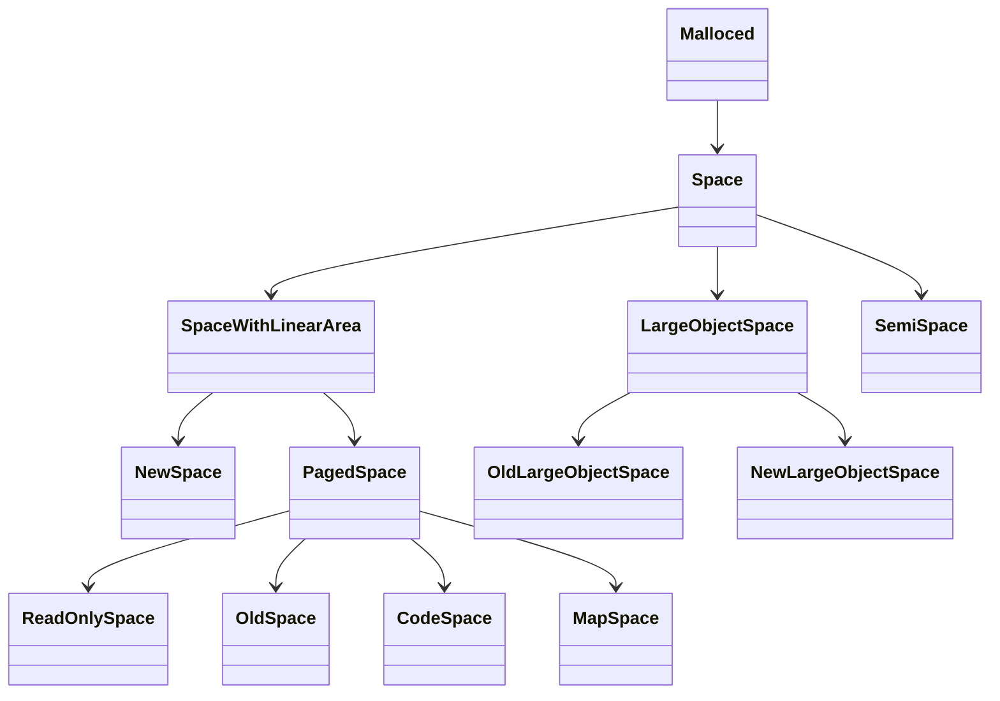
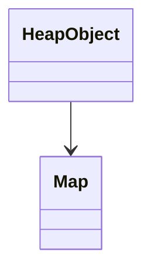

D Isolate::GetHeapStatistics begin
LD Heap::CommittedMemory
LD NewSpace:CommittedMemory
LD LargeObjectSpace:Size
LD Heap::CommittedOldGenerationMemory
LD SpaceId: 2
LD SpaceId: 3
LD SpaceId: 4
LD LargeObjectSpace:Size
LD LargeObjectSpace:Size
LD FreeList::Available
LD FreeList::Available
LD FreeList::Available
LD PagedSpace::Size
LD PagedSpace::Size
LD PagedSpace::Size
LD PagedSpace::Size
LD Isolate::GetHeapStatistics end

```
  RO_SPACE,    // Immortal, immovable and immutable objects,
  NEW_SPACE,   // Young generation semispaces for regular objects collected with
               // Scavenger.
  OLD_SPACE,   // Old generation regular object space.
  CODE_SPACE,  // Old generation code object space, marked executable.
  MAP_SPACE,   // Old generation map object space, non-movable.
  LO_SPACE,    // Old generation large object space.
  CODE_LO_SPACE,  // Old generation large code object space.
  NEW_LO_SPACE,   // Young generation large object space.
```

/Users/hsiao/Developer/node/deps/v8/src/common/globals.h
constexpr size_t kMinExpectedOSPageSize = 64 \* KB;

NEW*SPACE
OLD_SPACE *
CODE*SPACE *
MAP*SPACE *
LO*SPACE *
NEW_LO_SPACE
CODE_LO_SPACE \*

GC heap:
NEW_SPACE
OLD_SPACE
CODE_SPACE
MAP_SPACE

Native heap（操作系统为线程提供的堆）:
LO_SPACE
NEW_LO_SPACE
CODE_LO_SPACE

## Memory overcommitment

[Memory overcommitment](https://en.wikipedia.org/wiki/Memory_overcommitment) 是一个内存管理方式或者说策略，目前很多操作系统都已支持。它在行为上的表现是，应用程序可以主动申请（或者被动分配）到一个内存地址，该内存地址远大于实际物理内存的大小

应用程序申请（或者说被分配的）的内存，称为 committed memory 或者 virtual memory。实际的物理内存，称为 physical memory

举例来说，我们在 4G 物理内存的机器上，开启了 4 个各占 1G 内存的应用，我们依然可以开启第 5 个应用。之所可以能够做到这样，就是因为：

- 应用活动的时候，通常并不会完全使用它申请的全部空间
- 可以利用磁盘存放一些活动频率不高的内存

基于上面的条件，操作系统提供了 Memory overcommitment 的内存管理机制来充分利用物理内存

## total_heap_size

v8_enable_shared_ro_heap 开启的情况下不包含 RO_SPACE 的大小，反之则包含 RO_SPACE 的大小

在 64bit 环境中，这个选项是默认关闭的。这是因为 64bit 环境中默认开启了 v8_enable_pointer_compression 选项，该选项和 v8_enable_shared_ro_heap
是互斥的

在 64bit 环境中，total_heap_size 是当前全部 Spaces 的 committed memory 大小集合

## total_heap_size_executable

当前 CODE_SPACE 和 CODE_LO_SPACE 所占的空间大小

## total_physical_size

total_heap_size 只的是从操作系统申请的内存，有的操作系统（比如 Linux）支持 [overcommit](https://en.wikipedia.org/wiki/Memory_overcommitment)

overcommit 简单说就是操作系统支持应用申请超过物理内存大小的内存，当应用申请一块内存后，操作系统会分配一块虚拟内存的空间，只有应用使用到的部分才会映射到物理内存

比如有一个应用会申请 1G 的内存（而常用 500M），在 4G 的物理内存下，操作系统依然支持开启最多 8 个左右这样的应用，操作系统内部的内存管理机制会利用交换空间等方式以达到这个功能

total_physical_size 这里指的就是上面例子中 500M 应用当前实际使用的物理内存

## total_available_size

当前可使用的堆大小，并不都是已经从



## SemiSpace

```cpp
// -----------------------------------------------------------------------------
// SemiSpace in young generation
//
// A SemiSpace is a contiguous chunk of memory holding page-like memory chunks.
// The mark-compact collector  uses the memory of the first page in the from
// space as a marking stack when tracing live objects.
class SemiSpace : public Space {
}
```

```cpp
// -----------------------------------------------------------------------------
// The young generation space.
//
// The new space consists of a contiguous pair of semispaces.  It simply
// forwards most functions to the appropriate semispace.

class V8_EXPORT_PRIVATE NewSpace
    : NON_EXPORTED_BASE(public SpaceWithLinearArea) {
// ...
 private:
  // The semispaces.
  SemiSpace to_space_;
  SemiSpace from_space_;
//...
}

NewSpace::NewSpace(Heap* heap, v8::PageAllocator* page_allocator,
                   size_t initial_semispace_capacity,
                   size_t max_semispace_capacity)
    : SpaceWithLinearArea(heap, NEW_SPACE, new NoFreeList()),
      to_space_(heap, kToSpace),
      from_space_(heap, kFromSpace) {
  DCHECK(initial_semispace_capacity <= max_semispace_capacity);

  to_space_.SetUp(initial_semispace_capacity, max_semispace_capacity);
  from_space_.SetUp(initial_semispace_capacity, max_semispace_capacity);
  if (!to_space_.Commit()) {
    V8::FatalProcessOutOfMemory(heap->isolate(), "New space setup");
  }
  DCHECK(!from_space_.is_committed());  // No need to use memory yet.
  ResetLinearAllocationArea();
}
```

64bit 上 pageSize 是 128kb

64bit 上 max_semi_space_size 默认是 16M，可以通过 `--max_semi_space_size` 进行修改，单位是 MB，实际大小可能会略大于参数指定的大小，向上取整到 2^n MB

min_semi_space_size 默认是 1MB 可以通过 `--min_semi_space_size` 进行修改，单位是 MB，可以指定超过 `max_semi_space_size` 大小的值，但生效的大小不会超过 `max_semi_space_size` 的设定



map 创建的时候会通过 [Map::StartInobjectSlackTracking](https://github.com/nodejs/node/blob/9cd523d148dcefa6dd86cb7ef6448520aad5c574/deps/v8/src/objects/map.cc#L2685) 设置一个倒数计数器 `7`

Runtime_CompleteInobjectSlackTrackingForMap 重新计算大小